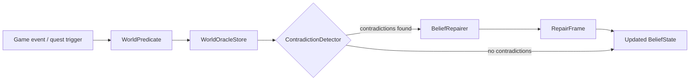

# worldoracle

[](https://github.com/sandeep-alluru/worldoracle/actions/workflows/ci.yml)
[](https://pypi.org/project/worldoracle/)
[](https://pypi.org/project/worldoracle/)
[](https://pepy.tech/project/worldoracle)
[](LICENSE)
[](https://codecov.io/gh/sandeep-alluru/worldoracle)
[](https://mypy.readthedocs.io)

**NPC contradiction detector and belief repair for game worlds.**

[Quick Start](#quick-start) · [How It Works](#how-it-works) · [Features](#features) · [CLI Reference](#cli-reference) · [MCP](#mcp--claude-desktop) · [OpenAI Tools](#openai-tools) · [Alternatives](#alternatives)

---

## Why

Game NPCs frequently end up with contradictory world models: the blacksmith "knows" the king is both alive and dead, the guard believes the bridge is passable while the quest log says it collapsed. These inconsistencies break immersion and cause dialogue bugs.

**worldoracle** gives every NPC a typed belief store with automatic contradiction detection and principled repair strategies — so your world stays consistent even when multiple event sources update the same facts.

---

## How It Works



1. **WorldPredicate** — a typed belief: `subject`, `attribute`, `value`, `source`, `confidence`, `timestamp`. Content-addressed by SHA-256 of `subject|attribute|str(value)`.
2. **BeliefState** — an NPC's full belief set; also content-addressed.
3. **ContradictionDetector** — scans for predicates with the same `(subject, attribute)` but different values.
4. **BeliefRepairer** — resolves each contradiction using strategies: `prefer_newer`, `prefer_higher_confidence`, `prefer_observation`.

---

## Features

| Feature | Status |
|---------|--------|
| Content-addressed predicates (SHA-256) | ✅ |
| SQLite persistence (`WorldOracleStore`) | ✅ |
| Contradiction detection | ✅ |
| Belief repair (3 strategies) | ✅ |
| Rich CLI (5 subcommands) | ✅ |
| FastAPI REST server | ✅ |
| MCP server for Claude Desktop | ✅ |
| OpenAI function-calling tools | ✅ |
| 67 tests, >98% coverage | ✅ |
| Fully typed (py.typed) | ✅ |

---

## Quick Start

```bash
pip install worldoracle
```

```python
from worldoracle import WorldPredicate, BeliefState, ContradictionDetector, BeliefRepairer

# Build a belief state
state = BeliefState(npc_id="guard-1")
state.add(WorldPredicate(subject="king", attribute="alive", value=True, source="quest-giver", confidence=0.8, timestamp=1.0))
state.add(WorldPredicate(subject="king", attribute="alive", value=False, source="observation", confidence=1.0, timestamp=2.0))

# Detect contradictions
detector = ContradictionDetector()
pairs = detector.detect(state)
print(f"Found {len(pairs)} contradiction(s)")

# Repair
repairer = BeliefRepairer()
for a, b in pairs:
    frame = repairer.repair(a, b)
    print(f"Resolved: {frame.resolved_value!r} ({frame.strategy})")
```

---

## CLI Reference

```
worldoracle [--db PATH] COMMAND [ARGS]
```

| Command | Description |
|---------|-------------|
| `add NPC_ID SUBJECT ATTRIBUTE VALUE` | Add a predicate to an NPC's belief state |
| `check NPC_ID` | Detect contradictions |
| `repair NPC_ID` | Generate repair frames for all contradictions |
| `beliefs NPC_ID` | List all beliefs for an NPC |
| `status` | Show database stats |

```bash
# Add beliefs
worldoracle add guard-1 king alive True --source observation --confidence 0.9 --timestamp 100
worldoracle add guard-1 king alive False --source rumor --confidence 0.5 --timestamp 50

# Check for contradictions
worldoracle check guard-1
# Found 1 contradiction(s) for guard-1:
#   CONFLICT: king.alive: 'True' vs 'False'

# Repair
worldoracle repair guard-1
```

---

## Repo Tree

```
worldoracle/
├── src/worldoracle/     ← Python package
│   ├── predicate.py     ← WorldPredicate, BeliefState, Detector, Repairer
│   ├── store.py         ← SQLite persistence
│   ├── cli.py           ← Click CLI
│   ├── api.py           ← FastAPI server
│   ├── mcp_server.py    ← MCP server
│   ├── report.py        ← Rich + JSON + Markdown formatters
│   └── py.typed
├── tests/               ← 45+ tests
├── docs/
├── tools/openai-tools.json
└── openapi.yaml
```

---

## MCP / Claude Desktop

Install the MCP server:

```bash
pip install "worldoracle[mcp]"
```

Add to `~/.config/claude/claude_desktop_config.json`:

```json
{
  "mcpServers": {
    "worldoracle": {
      "command": "worldoracle-mcp"
    }
  }
}
```

Tools exposed: `add_predicate`, `check_beliefs`, `repair_contradictions`.

See [docs/mcp.md](docs/mcp.md) and [Smithery](https://smithery.ai) for hosted registry.

---

## OpenAI Tools

The `tools/openai-tools.json` file defines function-calling schemas for GPT-4o and Codex CLI:

```bash
cat tools/openai-tools.json
```

See [docs/openai.md](docs/openai.md) for integration examples.

---

## Alternatives

| Tool | Approach | worldoracle advantage |
|------|----------|-----------------------|
| Manual quest flags | Unstructured booleans | Typed, content-addressed, auditable |
| Event sourcing logs | Append-only, no repair | Built-in contradiction detection + repair |
| Prolog / logic engines | Heavyweight runtime | Zero-dep Python, SQLite storage |
| LLM world models | Probabilistic, opaque | Deterministic, inspectable, fast |

---

## Topics

This project is tagged: `#npc` `#game-ai` `#belief-revision` `#llm` `#agents` `#mcp` `#fastapi`

GitHub Topics: `npc`, `belief-revision`, `game-ai`, `contradiction`, `agents`, `mcp`, `llmops`

---

## Star History

[](https://star-history.com/#sandeep-alluru/worldoracle&Date)
