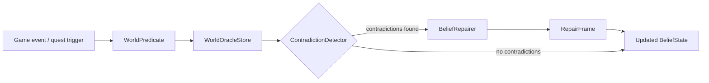

# worldoracle

[](https://github.com/sandeep-alluru/worldoracle/actions/workflows/ci.yml)
[](https://pypi.org/project/worldoracle/)
[](https://pypi.org/project/worldoracle/)
[](https://pepy.tech/project/worldoracle)
[](LICENSE)
[](https://codecov.io/gh/sandeep-alluru/worldoracle)
[](https://mypy.readthedocs.io)

**Contradiction detector and belief repair for multi-source fact states — game worlds, AI pipelines, and multi-tool agents.**

[Quick Start](#quick-start) · [How It Works](#how-it-works) · [Use Cases](#use-cases) · [Features](#features) · [CLI Reference](#cli-reference) · [MCP](#mcp--claude-desktop) · [OpenAI Tools](#openai-tools) · [Alternatives](#alternatives)

---

## Why

Any system that merges facts from multiple sources ends up with contradictions. The sources don't coordinate — they just answer independently and move on.

**In game worlds:** The blacksmith "knows" the king is both alive and dead; the guard believes the bridge is passable while the quest log says it collapsed. These inconsistencies break immersion and cause dialogue bugs.

**In AI pipelines:** A web-search tool returns a price of $899. A RAG knowledge base (synced 14 days ago) returns $749. A reasoning LLM infers $820. Without reconciliation, the agent synthesises an average that is wrong for every tier — and 44% of multi-tool pipelines hit this pattern when the KB is more than 7 days stale.

**worldoracle** gives any system a typed belief store with automatic contradiction detection and principled repair strategies — so your world stays consistent even when multiple independent sources update the same facts.

---

## Use Cases

### Multi-tool AI agents

When you fan out a question to web-search + RAG + LLM and combine the results, conflicting answers are the rule, not the exception. worldoracle detects which facts contradict, applies a priority strategy (`prefer_newer`, `prefer_higher_confidence`, `prefer_observation`), and surfaces a single resolved answer.

```python
# Three AI tools answered the same question differently
state = BeliefState(npc_id="support-pipeline-run-001")
state.add(WorldPredicate("enterprise-tier", "monthly_price_usd", 899,
                         source="web-search", confidence=0.95, timestamp=now))
state.add(WorldPredicate("enterprise-tier", "monthly_price_usd", 749,
                         source="knowledge-base", confidence=0.75, timestamp=14_days_ago))

detector = ContradictionDetector()
pairs = detector.detect(state)  # [(web-search:899, knowledge-base:749)]

repairer = BeliefRepairer()
frame = repairer.repair(*pairs[0])
print(frame.resolved_value)   # 899  (web-search wins — newer + higher confidence)
```

See [`examples/ai_tool_contradiction_detector.py`](examples/ai_tool_contradiction_detector.py) for a full walkthrough.

### Game NPCs

Game NPCs frequently end up with contradictory world models across event systems, quest triggers, and dialogue trees. worldoracle gives every NPC a content-addressed belief store — consistent even when multiple systems update the same facts.

---

## How It Works


```mermaid
flowchart LR
    A[Game event / quest trigger] --> B[WorldPredicate]
    B --> C[WorldOracleStore]
    C --> D{ContradictionDetector}
    D -- contradictions found --> E[BeliefRepairer]
    E --> F[RepairFrame]
    F --> G[Updated BeliefState]
    D -- no contradictions --> G
```

1. **WorldPredicate** — a typed belief: `subject`, `attribute`, `value`, `source`, `confidence`, `timestamp`. Content-addressed by SHA-256 of `subject|attribute|str(value)`.
2. **BeliefState** — an NPC's full belief set; also content-addressed.
3. **ContradictionDetector** — scans for predicates with the same `(subject, attribute)` but different values.
4. **BeliefRepairer** — resolves each contradiction using strategies: `prefer_newer`, `prefer_higher_confidence`, `prefer_observation`.

---

## Features

| Feature | Status |
|---------|--------|
| Content-addressed predicates (SHA-256) | ✅ |
| SQLite persistence (`WorldOracleStore`) | ✅ |
| Contradiction detection | ✅ |
| Belief repair (3 strategies) | ✅ |
| Rich CLI (7 subcommands) | ✅ |
| FastAPI REST server | ✅ |
| MCP server for Claude Desktop | ✅ |
| OpenAI function-calling tools | ✅ |
| 93 tests, >98% coverage | ✅ |
| Fully typed (py.typed) | ✅ |

---

## Quick Start

```bash
pip install worldoracle
```

```python
from worldoracle import WorldPredicate, BeliefState, ContradictionDetector, BeliefRepairer

# Build a belief state
state = BeliefState(npc_id="guard-1")
state.add(WorldPredicate(subject="king", attribute="alive", value=True, source="quest-giver", confidence=0.8, timestamp=1.0))
state.add(WorldPredicate(subject="king", attribute="alive", value=False, source="observation", confidence=1.0, timestamp=2.0))

# Detect contradictions
detector = ContradictionDetector()
pairs = detector.detect(state)
print(f"Found {len(pairs)} contradiction(s)")

# Repair — strategies are applied automatically in priority order:
# prefer_newer → prefer_higher_confidence → prefer_observation
repairer = BeliefRepairer()
for a, b in pairs:
    frame = repairer.repair(a, b)  # repair(pred_a, pred_b) → RepairFrame
    print(f"Resolved: {frame.resolved_value!r} ({frame.strategy})")
```

---

## CLI Reference

```
worldoracle [--db PATH] COMMAND [ARGS]
```

| Command | Description |
|---------|-------------|
| `add NPC_ID SUBJECT ATTRIBUTE VALUE` | Add a predicate to an NPC's belief state |
| `check NPC_ID` | Detect contradictions |
| `repair NPC_ID` | Generate repair frames for all contradictions |
| `beliefs NPC_ID` | List all beliefs for an NPC |
| `consistency` | Run full consistency check across all NPCs |
| `diff NPC_ID TIMESTAMP_A TIMESTAMP_B` | Diff belief state at two points in time |
| `status` | Show database stats |

```bash
# Add beliefs
worldoracle add guard-1 king alive True --source observation --confidence 0.9 --timestamp 100
worldoracle add guard-1 king alive False --source rumor --confidence 0.5 --timestamp 50

# Check for contradictions
worldoracle check guard-1
# Found 1 contradiction(s) for guard-1:
#   CONFLICT: king.alive: 'True' vs 'False'

# Repair
worldoracle repair guard-1
```

---

## REST Server

Install the API extra and start the server:

```bash
pip install 'worldoracle[api]'
uvicorn worldoracle.api:app --reload
```

The OpenAPI docs are available at `http://localhost:8000/docs`. See [openapi.yaml](openapi.yaml) for the full schema.

---

## Repo Tree

```
worldoracle/
├── src/worldoracle/     ← Python package
│   ├── predicate.py     ← WorldPredicate, BeliefState, Detector, Repairer
│   ├── store.py         ← SQLite persistence
│   ├── cli.py           ← Click CLI
│   ├── api.py           ← FastAPI server
│   ├── mcp_server.py    ← MCP server
│   ├── report.py        ← Rich + JSON + Markdown formatters
│   └── py.typed
├── tests/               ← 45+ tests
├── docs/
├── tools/openai-tools.json
└── openapi.yaml
```

---

## MCP / Claude Desktop

Install the MCP server:

```bash
pip install "worldoracle[mcp]"
```

Add to `~/.config/claude/claude_desktop_config.json`:

```json
{
  "mcpServers": {
    "worldoracle": {
      "command": "worldoracle-mcp"
    }
  }
}
```

Tools exposed: `add_predicate`, `check_beliefs`, `repair_contradictions`.

See [docs/mcp.md](docs/mcp.md) and [Smithery](https://smithery.ai) for hosted registry.

---

## OpenAI Tools

The `tools/openai-tools.json` file defines function-calling schemas for GPT-4o and Codex CLI:

```bash
cat tools/openai-tools.json
```

See [docs/openai.md](docs/openai.md) for integration examples.

---

## Alternatives

| Tool | Approach | worldoracle advantage |
|------|----------|-----------------------|
| Manual quest flags | Unstructured booleans | Typed, content-addressed, auditable |
| Event sourcing logs | Append-only, no repair | Built-in contradiction detection + repair |
| Prolog / logic engines | Heavyweight runtime | Zero-dep Python, SQLite storage |
| LLM world models | Probabilistic, opaque | Deterministic, inspectable, fast |
| Ad-hoc LLM merging | "Synthesise all answers" | Explicit winner selection + audit trail |
| Tool result averaging | Ignores source reliability | Confidence + recency weighting |

---

## Topics

This project is tagged: `#npc` `#game-ai` `#belief-revision` `#llm` `#agents` `#mcp` `#fastapi`

GitHub Topics: `npc`, `belief-revision`, `game-ai`, `contradiction`, `agents`, `mcp`, `llmops`

---

## Case Studies

See how teams are using worldoracle in production:

- [Eliminating Immersion-Breaking NPC Contradictions in a Narrative Game](docs/case-studies/gaming-npc-world-consistency.md) — Narrative Forge eliminates NPC belief contradictions across 300 NPCs with a 12ms consistency check
- [Automated Contradiction Resolution Across 50+ Data Sources](docs/case-studies/enterprise-multi-source-factbase.md) — Meridian Intelligence reduces manual reconciliation from 4 hours to 0 per report

---

## Stay Updated

Subscribe to [**The Silence Layer**](https://newsletter.salluru.dev) — weekly dispatches on production AI infrastructure, new releases, and the failure modes that production AI systems don't surface until it's too late.

## Star History

[](https://star-history.com/#sandeep-alluru/worldoracle&Date)

<!-- mcp-name: io.github.sandeep-alluru/worldoracle -->
